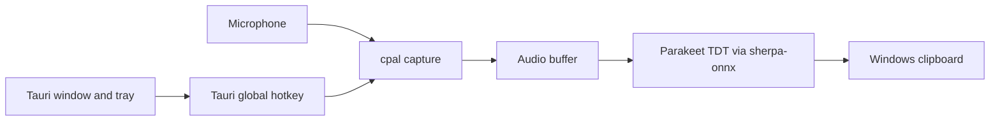

# WhisperPete Architecture

WhisperPete 1.0.0 is a Rust/Tauri desktop application. The former .NET/WPF/Olive implementation has been retired.

## Components

1. **Tauri 2 shell:** Provides the application window, tray icon, and global `Alt+Shift+Space` shortcut.
2. **Rust capture:** Uses `cpal` to capture microphone input and normalize samples.
3. **Local transcription:** Uses the sherpa-onnx Rust API with the Parakeet TDT 0.6B v3 INT8 model.
4. **Clipboard output:** Copies successful transcripts to the Windows clipboard. Automatic text injection is intentionally disabled during early release testing.
5. **Model storage:** Reads model files from `%LOCALAPPDATA%\WhisperPete\models`.

All audio processing and transcription remain local. No cloud service or application-context capture is part of the current product.
