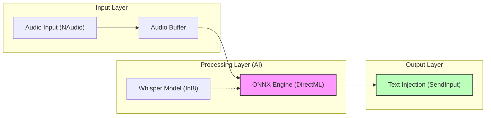

# WhisperPete Architecture

This document describes the core architecture of WhisperPete using Mermaid diagrams for native rendering.

## System Flow

## Description

1. **Input Layer**: Captures raw audio via `NAudio` and buffers it for processing.
2. **Processing Layer**: The heart of the app. It uses `ONNX Runtime` with `DirectML` to leverage RTX GPUs for high-speed transcription.
3. **Output Layer**: Once transcribed, the text is programmatically injected into the active window using the Windows `SendInput` API.
